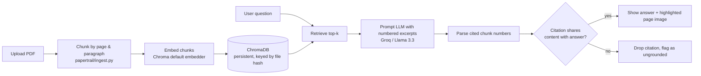

# PaperTrail

Chat with a PDF. Every claim in the answer is cited by page number, and every citation is **programmatically verified** against the retrieved text before it's shown — not just asserted by the model.

**[Live demo](https://papertrail-ljg4.onrender.com/) · Built as a from-scratch RAG project to learn the mechanics, not just wire up a framework.**

## Why this one is different

Most "chat with your PDF" demos trust the LLM to cite itself correctly. LLMs hallucinate citations as readily as they hallucinate facts. PaperTrail's generation step (`papertrail/rag.py`) does one extra thing: after the model answers with `[1]`-style markers, the code checks whether the cited chunk actually shares content with the answer text. Citations that don't survive that check are dropped and the answer is flagged as ungrounded. The UI then renders the surviving citations as the actual PDF page image with the source paragraph outlined in red — a page number you have to trust vs. a picture you can check in one glance.

## Architecture



## How it works

1. **Ingest** (`ingest.py`) — pymupdf extracts text blocks per page, each with its bounding box. Blocks are merged into ~800-char chunks (100-char overlap) without crossing page boundaries, so every chunk maps to exactly one page and one highlightable rectangle.
2. **Index** (`index.py`) — chunks go into a ChromaDB collection keyed by a SHA-256 hash of the PDF bytes, so re-uploading the same file skips re-embedding.
3. **Retrieve** — the question is embedded and the top-5 most similar chunks come back.
4. **Generate + verify** (`rag.py`) — the LLM (Llama 3.3 70B via Groq's free API) gets the chunks as numbered excerpts and must cite by number or say "Not found in the document." Every `[n]` it emits is checked for actual word overlap with its cited chunk before being trusted.
5. **Render** (`app.py`) — a Gradio UI shows the answer in a chat window; each surviving citation appears in a gallery as the real PDF page with the cited paragraph outlined.

## Two implementations

| | `papertrail/` (v1) | `langchain_impl/` (v2) |
|---|---|---|
| Lines of code | ~150 | ~60 |
| Citation verification | Built in | Not supported by the framework's chain interface — would need custom wiring |
| Page-level highlighting | Built in (bbox tracked end-to-end) | Not available — retriever only exposes page numbers |
| What it teaches | Chunking, embeddings, retrieval, prompt design — all explicit | How LangChain composes the same pieces via LCEL |

The hand-rolled version exists first on purpose: the citation-verification step is the whole point of this project, and it only works because chunk metadata (page + bbox) is tracked explicitly all the way from ingestion to render. LangChain's abstractions optimize for "get an answer," not "prove where the answer came from."

## Setup

```bash
python3.12 -m venv .venv && source .venv/bin/activate
pip install -e ".[dev]"
export GROQ_API_KEY=...   # free at console.groq.com
python app.py
```

## Evaluation

`evals/golden.jsonl` has hand-written Q&A pairs against the ["Attention Is All You Need"](https://arxiv.org/pdf/1706.03762) paper. Scored with [Ragas](https://github.com/explodinggradients/ragas), judged by a separate, lighter Groq model so judging doesn't compete with generation for the same daily token quota:

```bash
pip install -e ".[eval]"
curl -L -o evals/sample.pdf https://arxiv.org/pdf/1706.03762
python evals/run_eval.py evals/sample.pdf evals/golden.jsonl
```

| Metric | Score |
|---|---|
| Faithfulness | _pending — see note below_ |
| Context Precision | _pending — see note below_ |
| Context Recall | _pending — see note below_ |

> Groq's free tier caps `llama-3.3-70b-versatile` at 100k tokens/day. Running this eval a couple of times while iterating on it burned through that cap for the day, so the numbers above are pending a rerun once the daily quota resets. Worth knowing going in if you're building on the same free tier: budget one clean eval run per day per model, not several while debugging.

## Deploying

Live at **https://papertrail-ljg4.onrender.com/**, deployed on [Render](https://render.com)'s free tier via the included `render.yaml` blueprint:

1. Push this repo to GitHub (already done if you're reading this there).
2. On Render: **New +** → **Blueprint** → connect the repo. It reads `render.yaml` automatically.
3. Render prompts for `GROQ_API_KEY` (marked `sync: false` in the blueprint so it's never committed) — paste it in.
4. Deploy. No GPU needed; embeddings run on Chroma's default CPU model.

Free-tier services spin down after 15 minutes idle, so the first request after a quiet period takes ~30-60s to cold-start — normal, not a bug.

## Limitations & what's next

- Single document at a time — no cross-document retrieval.
- Pure vector search misses exact keyword matches (part numbers, names); hybrid BM25 + vector search is the standard fix.
- No reranking step between retrieval and generation.
- Citation verification is a word-overlap heuristic, not semantic entailment — good enough to catch outright fabrication, not subtle misattribution.
